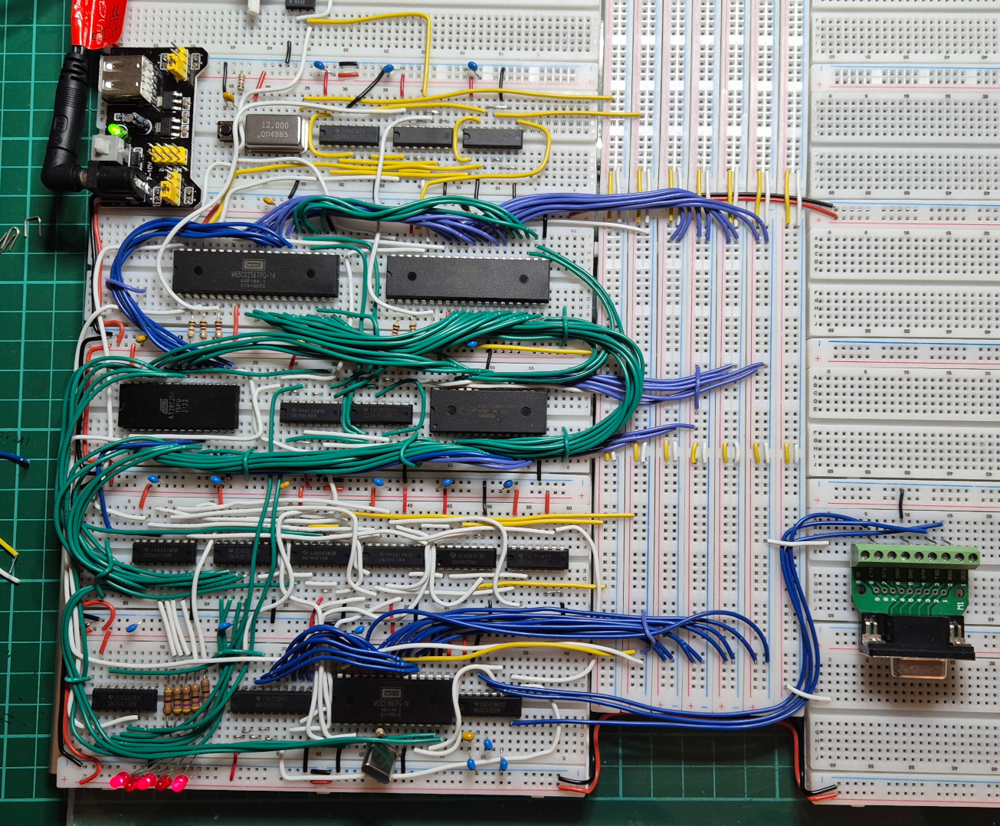
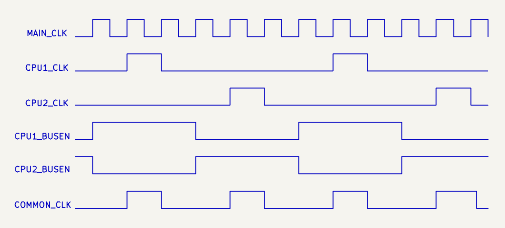
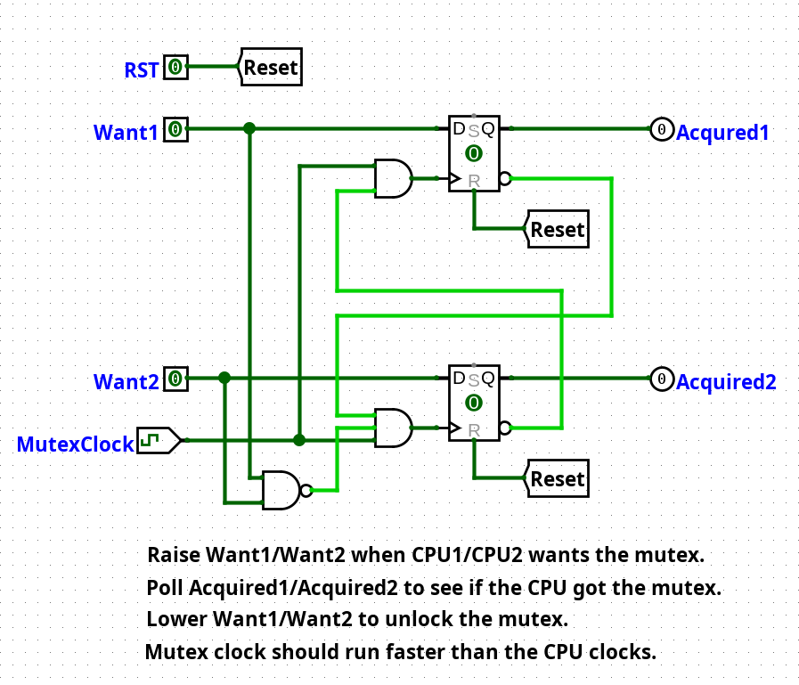

Dual Core 65C02 Computer
========================

This repository contains schematics, documentation, and program code for my
dual core 65C02 computer.  The computer has two 65C02 microprocessors,
sharing a common memory and I/O bus for symmetric multiprocessing (SMP),
8-bit style.

Here is what it looks like on a breadboard (PCB's are in progress).
The two large 40-pin chips at the top are the CPU's.

## How did this happen?

Steve Wozniak's design of the Apple II avoided video snow by alternating
access to main memory between the 6502 CPU and the video system.  The two
systems cannot collide and thus cannot create snow.

I asked myself, "Could I do that with two CPU's?" and an obsession was born.

## How does it work?

The W65C02S CPU from Western Digital simplifies things.  The BE
(bus enable) pin can be pulled low to take the CPU completely off the bus
temporarily.  By alternating the bus enables, each CPU can be given
access to memory and I/O in turn.

It would theoretically be possible to do this with the original 6502
microprocessor, but extra bus transceivers would be required as
the original 6502 does not have a BE pin.  The Apple II design
includes bus transceivers for exactly this purpose.

The main 12MHz crystal oscillator is divided down into a number of
component clock signals:

<table border="1">
<tr><td><b>Signal</b></td><td><b>Description</b></td></tr>
<tr><td>CPU1 CLK</td><td>2MHz clock for CPU1</td></tr>
<tr><td>CPU2 CLK</td><td>2MHz clock for CPU2</td></tr>
<tr><td>CPU1 BUSEN</td><td>2MHz bus enable for CPU1</td></tr>
<tr><td>CPU2 BUSEN</td><td>2MHz bus enable for CPU2</td></tr>
<tr><td>COMMON CLK</td><td>4MHz common clock for memory and I/O</td></tr>
</table>

## Memory map

<table border="1">
<tr><td><b>Address Range</b></td><td><b>Description</b></td></tr>
<tr><td>$0000 - $00FF</td><td>Zero page for CPU 1</td></tr>
<tr><td>$0100 - $01FF</td><td>Stack for CPU 1</td></tr>
<tr><td>$0200 - $02FF</td><td>Zero page for CPU 2</td></tr>
<tr><td>$0300 - $03FF</td><td>Stack for CPU 2</td></tr>
<tr><td>$0400 - $7FFF</td><td>Shared RAM (31K)</td></tr>
<tr><td>$8000 - $81FF</td><td>Main board I/O</td></tr>
<tr><td>$8200 - $83FF</td><td>Versatile Interface Adapter (VIA)</td></tr>
<tr><td>$8400 - $84FF</td><td>Asynchronous Communications Interface Adapter (ACIA)</td></tr>
<tr><td>$8600 - $87FF</td><td>RCbus I/O address space</td></tr>
<tr><td>$8800 - $8FFF</td><td>Spare I/O address space</td></tr>
<tr><td>$9000 - $BFFF</td><td>Unused memory space (12K)</td></tr>
<tr><td>$C000 - $FFFF</td><td>CPU-specific ROM (16K)</td></tr>
</table>

Address ranges $0000 - $01FF and $0200 - $03FF are swapped in CPU2 so that
CPU2 sees its zero page and stack starting at $0000 and sees CPU1's
zero page and stack starting at $0200.  This keeps the zero pages and
stacks separate.

The design uses a 32K EEPROM, divided into two 16K halves.  CPU1 sees
the first half of the ROM and CPU2 sees the second half of the ROM.
Thus, different programs can run on each CPU, or the same program.
It is up to the programmer.  This repository contains a minimal
[BIOS](src/common/bios.s) for initializing and accessing the hardware.

The main board decodes 8 I/O device address ranges between $8000 and $8FFF,
each consisting of 512 bytes ($0200 hex).  Four of these are used for
purposes on the main board.  The others are spare for expansion boards.

The 12K of unused memory space can be used for bank-switched RAM, video
memory, cartridge ROM's, or anything you want.

## Mutual exclusion

In any multi-core system, some method is required to synchronise access to
memory and I/O across the cores.  The 65C02 takes multiple clock cycles to
perform a read-modify-write instruction like "INC" or "DEC".  The other core
could get in the middle of that and mess things up.

According to the W65C02S datasheet, the ML pin can be used to co-ordinate
bus accesses when read-modify-write instructions are being performed.
I experimented with a method to "stretch" the bus enable signals to
delay the other CPU while the current one was performing a read-modify-write.
But I wasn't able to make it stable.

Instead, I use two flip-flops and some I/O pins to provide mutual exclusion.
In Logisim, it looks like this:

When CPU1 wants the mutex, it raises the Want1 pin (address $8107, bit 0) and
then polls the Acquired1 signal (address $8080, bit 7).  Once the acquired
signal goes high, CPU1 has the mutex.  To release the mutex, lower the
Want1 pin.

CPU2 does the same thing with Want2 (address $8106, bit 0) and
Acquired2 (address $8080, bit 6).

The mutex is "fair" in the sense that when one CPU lowers its Want pin,
the other CPU is guaranteed to immediately get the mutex if it had
previously raised its Want pin.  It is impossible for one CPU to
hog the mutex, except by forgetting to unlock it.

The [BIOS](src/common/bios.s) provides the subroutines `mutex_lock`,
`mutex_unlock`, and `mutex_try_lock` to make things easier for the
programmer.  The implementation is different for each CPU.

## System millisecond tick timer

There is a 555 timer in the circuit that delivers a 1000Hz signal to the
NMI pins on each of the CPU's.  A potentiometer allows the frequency to
be dialed in precisely.

The default NMI handler in the BIOS increments a 24-bit millisecond
tick counter which wraps around after 4 hours and 39 minutes.
Call the `systick` subroutine to fetch the value of the tick counter
safely into the Y:A:X register triple.

NMI can interfere with foreground code and regular IRQ handlers,
which may affect timing-critical code.  There are jumpers in the circuit
that allow the 555 to be disconnected from one or both of the CPU's.

## Schematic and other technical information

* [PDF of the schematic](schematics/DualCore6502Whole/PDF/DualCore6502Whole.pdf)
* [Parts list](doc/parts-list.md)

## What can't it do?

DMA is not currently supported.  Pausing the clocks and bus enables to allow
external access to the bus is complicated.  Too complicated for my feeble brain.
Maybe in the next version.

In theory the W65C02S can go up to 14MHz.  While SRAM that is faster than
70ns access time is possible, EEPROM chips in DIP form are typically 150ns.
In practice, this limits the maximum memory speed to about 4MHz.
An alternative memory design with wait states may allow pushing the
performance further.  Once again, my feeble brain isn't up to the task.

Could we have more CPU's?  Four?  Eight?  In theory, yes.  But memory
access times limit things.  The speed of the individual CPU's would need to be
reduced to 1MHz to allow four on the bus, executing one after another.
The effective speed of the system would remain at 4MHz.  An alternate design
might give each CPU its own fast SRAM, with wait states for access to
common RAM, ROM, and I/O.

## TODO

* Lay out a PCB and make something more industrialized.
* Machine monitor for loading programs into RAM via the serial port and
debugging them.
* Devise a multi-core operating system to showcase the capabilities.

## License

Distributed under the terms of the MIT license.

## Contact

For more information on this code, to report bugs, or to suggest
improvements, please contact the author Rhys Weatherley via
[email](mailto:rhys.weatherley@gmail.com).
